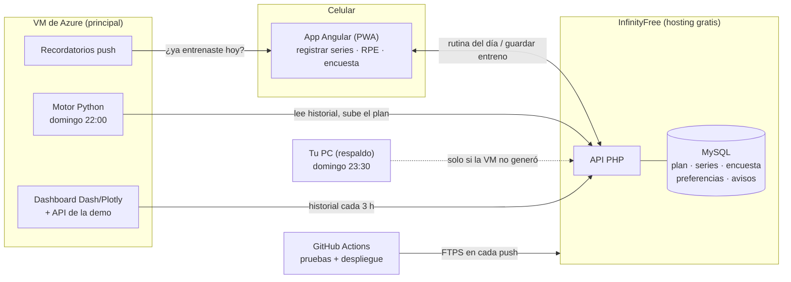

# GymTracker

**Un entrenador personal que vive en tu celular.** Registras cada serie en la app; cada domingo un motor en Python lee tu historial, estima tu fuerza en cada ejercicio y te arma la semana siguiente, con pesos, series y técnicas basadas en evidencia científica. Un dashboard te enseña cómo vas.

| | Enlace |
|---|---|
| 📱 App (PWA, se instala en el iPhone) | https://aguilarmunoz.infinityfree.me |
| 📊 Dashboard | https://20-150-209-104.sslip.io |
| 🔬 Por qué cada regla del motor | [`docs/CAMBIOS_EVIDENCIA.md`](docs/CAMBIOS_EVIDENCIA.md) |

---

## Cómo funciona



**Una semana normal:**

1. **Domingo 22:00**: la VM descarga tu historial, calcula la semana siguiente y la sube. Si la VM estaba apagada, tu PC lo hace a las 23:30 o al encenderse. Si ninguno pudo, existe `python-engine/generar_rutina_manual.bat`. Los tres revisan primero si ya se generó, así que no se pisan.
2. **Lunes a sábado**: abres la app, te muestra la rutina del día, registras peso, reps y RPE, y al terminar guardas. Si no hay internet, el entreno queda en el teléfono y se sube solo después.
3. **Cuando quieras**: el dashboard muestra progresión, récords, fatiga, volumen por músculo y el mesociclo completo.

---

## El motor (`python-engine/`)

Es la parte invisible y la más importante: trabaja como lo haría un entrenador con tus registros.

- **Modelo de fuerza por ejercicio** (`entrenador.py`): estima tu 1RM con cada serie usando el RPE (tabla RTS + Epley), lo suaviza en el tiempo y detecta desentrenamiento tras 4 semanas sin hacer el ejercicio. Con eso prescribe la carga, no solo "+2.5 kg porque sí".
- **Mesociclo de 5 semanas**: S1 base → S2 rotación → S3 superar S1 → S4 pico → S5 descarga. El RPE objetivo sube de 8 a 9 y el fallo solo aparece en S3–S4, en la última serie.
- **Se adapta a ti**:
  - **Encuesta muscular** (dolor, bombeo, carga): ajusta las series de cada músculo de −2 a +3.
  - **Dolor articular**: cambia el ejercicio que te molestó.
  - **Energía y sueño**: con 3 o más días malos adelanta la descarga.
  - **Ejercicio que no rinde**: lo detecta y lo calibra.
- **Pesos que existen en tu gym**: discos de 1.25 kg en barra, tu lista real de mancuernas (`mancuernas_kg`) y el paso de la máquina asistida.
- **Plan construido por reglas** (`generador.py`): elige ejercicios por el estímulo de cada submúsculo, con topes por región, protección lumbar y rotación entre mesociclos. Respeta tus días de deporte (básquetbol) y la duración de sesión que elijas.

| Configuración | Opciones |
|---|---|
| Enfoque | Recomposición · Volumen · Definición · Powerbuilding · Fuerza |
| Split | Upper/Lower 4 días · Upper/Lower 5 días · Push/Piernas/Pull · Full Body |
| Duración | 60 · 75 · 90 · 120 min |
| Además | Músculos prioritarios, equipo que tu gym no tiene, peso corporal |

Catálogo: 98 ejercicios comunes, etiquetados por patrón de movimiento y submúsculo. Cada regla tiene su cita en [`docs/CAMBIOS_EVIDENCIA.md`](docs/CAMBIOS_EVIDENCIA.md).

---

## La app (`app/`)

Angular 20 (standalone + signals) como PWA: se agrega a la pantalla de inicio y funciona sin conexión.

- **Tarjetas por ejercicio** con todas sus series (Top Set, Back-off, volumen), RPE objetivo y tu marca anterior a superar.
- **Cronómetro de descanso** que sigue contando con la pantalla bloqueada, con alarma y vibración.
- **Entreno a prueba de cierres**: lo que llevas se guarda en el teléfono (IndexedDB) y si la app se cierra lo recupera. Lo que no se pudo subir queda en cola y se reenvía.
- **Al guardar**: un resumen de la sesión y confeti si rompiste un récord.
- **"¿Cómo te sientes hoy?"** (energía y sueño) y la **encuesta por músculo**. Alimentan al motor.
- **Máquina ocupada**: alternativas del mismo patrón, sacadas del catálogo del motor. Con **"Usar siempre"** el cambio se queda para las siguientes semanas.
- **Mover el día de descanso** de la semana, historial de sesiones, mapa muscular, tema claro y oscuro.
- **Avisos push** a las 6 pm si hoy toca gym y no has registrado nada. En iPhone la app tiene que estar instalada (iOS 16.4+).

---

## El dashboard (`python-engine/dashboard.py`)

Dash + Plotly, público en la VM y también se puede abrir local con `GymTracker.bat`. Funciona en computadora y en celular.

| Pestaña | Qué ves |
|---|---|
| Resumen | Tonelaje y frecuencia semanal, volumen por bloque, RPE |
| Progresión | Peso máximo, e1RM y tonelaje de cada ejercicio |
| Récords | Tu mejor e1RM por ejercicio y la serie que lo logró |
| Fatiga (RPE) | RPE semanal con zona óptima y zona de descarga, y calibración de tu RPE |
| Volumen | Series efectivas por músculo contra MEV, MAV y MRV, y lo que cambió la encuesta |
| Peso corporal | Peso y cintura, media de 7 días y semáforo calórico |
| Logbook | Todas las series, con filtros |
| ⚙ Configuración | Enfoque, split, prioridades, duración, equipo y macros en gramos |
| Plan semana / Mesociclo | La semana siguiente y las 5 semanas. Se pueden recalcular, subir y copiar |

### Modo demo

Sirve para enseñar el sistema sin tocar tus datos. Hay un acceso oculto tanto en la app como en el dashboard. Los datos salen de un **atleta virtual** (`simulador.py`) que entrena con el motor real. Se puede elegir cualquier enfoque y split y recorrer las 5 semanas y los 7 días. Nada se guarda: en el dashboard la configuración vive en una cookie y en la app, en memoria.

---

## Servidores y despliegue

| Dónde | Qué corre | Cuándo |
|---|---|---|
| **VM de Azure** (`servidor/`) | `gymtracker-motor`: genera la semana | Domingo 22:00 (hora de México) |
| | `gymtracker-datos`: actualiza el historial del dashboard | Cada 3 h |
| | `gymtracker-recordatorio`: aviso push | Cada hora (avisa a la hora de tu config) |
| | `gymtracker-dashboard`: gunicorn detrás de Caddy (HTTPS) | Siempre |
| **Tu PC** | Respaldo del motor (tarea programada) | Domingo 23:30 o al encender |
| **GitHub Actions** (`.github/workflows/desplegar.yml`) | Corre las 5 suites de pruebas, compila la app y la sube a InfinityFree por FTPS | En cada push a `main` que toque `app/`, `infinityfree/` o `python-engine/` |

**Actualizar la VM** después de un cambio en el motor o el dashboard:

```bash
ssh azureuser@20.150.209.104
cd ~/gym && git pull && bash servidor/instalar_vm.sh
```

`infinityfree/api/config.php` (credenciales de la base de datos) nunca se sube ni se sobrescribe desde el CI ni desde `deploy/`. Para la subida manual existe `Construir app para subir.bat`.

### Otra persona con su propia copia

Doble clic en **`Nuevo usuario.bat`** y sigue la guía [`docs/NUEVO_USUARIO.md`](docs/NUEVO_USUARIO.md). Esa persona recibe su propia app, base de datos, motor y dashboard (`nombre.20-150-209-104.sslip.io`), sin tocar nada de lo tuyo. Después, cada push actualiza su app y `instalar_vm.sh` actualiza su copia en la VM.

---

## Estructura

```
gym/
├── app/                      App Angular (PWA)
│   └── src/app/              componente, servicio API, almacen (IndexedDB), demo
├── infinityfree/
│   ├── schema.sql            tablas MySQL
│   └── api/                  endpoints PHP (rutina, entreno, historial, encuesta,
│                             preferencias, suscripciones push, plan)
├── python-engine/
│   ├── planificar.py         motor semanal (sobrecarga progresiva, descargas)
│   ├── entrenador.py         modelo de fuerza por ejercicio
│   ├── generador.py          arma el plan según tu configuración
│   ├── ejercicios_db.py      catálogo + estímulo por submúsculo
│   ├── enfoques.py           enfoques y splits
│   ├── feedback.py           encuesta, dolor, bienestar, preferencias
│   ├── volumen.py            series efectivas por músculo
│   ├── simulador.py          atleta virtual
│   ├── demo_motor.py         escenarios de la demo
│   ├── dashboard.py          dashboard + API de la demo
│   ├── avisos.py / recordatorio.py   notificaciones push
│   ├── respaldo_semanal.py   genera la semana solo si falta (VM, PC o a mano)
│   └── tests/                5 suites de pruebas
├── servidor/                 instalación de la VM (systemd, Caddy) y copias de otras personas
├── instancias/               lista de personas con su propia copia (docs/NUEVO_USUARIO.md)
├── docs/                     evidencia científica, informe, tesis
└── .github/workflows/        pruebas + despliegue automático
```

---

## Desarrollo local

**Motor y dashboard**

```powershell
cd python-engine
py -m venv .venv
.\.venv\Scripts\Activate.ps1
pip install -r requirements.txt
copy .env.example .env        # API_BASE_URL, API_TOKEN, MES_INICIO
python dashboard.py           # http://127.0.0.1:8050
$env:DRY_RUN=1; python planificar.py   # calcula la semana sin subirla
```

O doble clic en `GymTracker.bat`: crea el entorno la primera vez y abre el dashboard.

**App**

```powershell
cd app
npm ci
npm start                     # http://localhost:4200  (demo: ?demo=1)
```

Si cambias el catálogo o la demo, regenera los archivos que usa la app:

```powershell
cd python-engine
python exportar_catalogo.py   # app/src/app/catalogo.generado.ts
python exportar_demo.py       # app/src/app/demo.generado.ts
```

---

## Pruebas

Las cinco corren en el CI antes de cada despliegue. Si una falla, no se sube nada.

| Suite | Qué comprueba |
|---|---|
| `test_motor.py` | Las reglas del motor, una por una (48 secciones) |
| `test_funcional.py` | Dashboard, helpers, aislamiento del modo demo y su API |
| `test_plan_qa.py` | Calidad del plan generado (35 criterios) |
| `test_barrido.py` | 13 440 semanas: todas las combinaciones sin violar ningún tope |
| `test_simulacion.py` | El motor como entrenador: 9 perfiles de atleta virtual progresan con cargas realistas |

```powershell
cd python-engine
python tests/test_motor.py    # y así con las demás
```

---

## Documentación

- [`docs/CAMBIOS_EVIDENCIA.md`](docs/CAMBIOS_EVIDENCIA.md): cada cambio del motor y de la app, con su fundamento y referencias.
- [`docs/NUEVO_USUARIO.md`](docs/NUEVO_USUARIO.md): darle GymTracker a otra persona, paso a paso.
- [`DOCUMENTACION.md`](DOCUMENTACION.md): documentación técnica (módulos y API).
- [`docs/Informe_Cientifico_GymTracker.pdf`](docs/Informe_Cientifico_GymTracker.pdf) y [`docs/Tesis_GymTracker.pdf`](docs/Tesis_GymTracker.pdf).

## Stack

Angular 20 · PHP 8 + MySQL (InfinityFree) · Python 3.11+ (pandas, Dash, Plotly, pywebpush) · VM de Azure (Ubuntu 24.04, systemd, gunicorn, Caddy) · GitHub Actions
